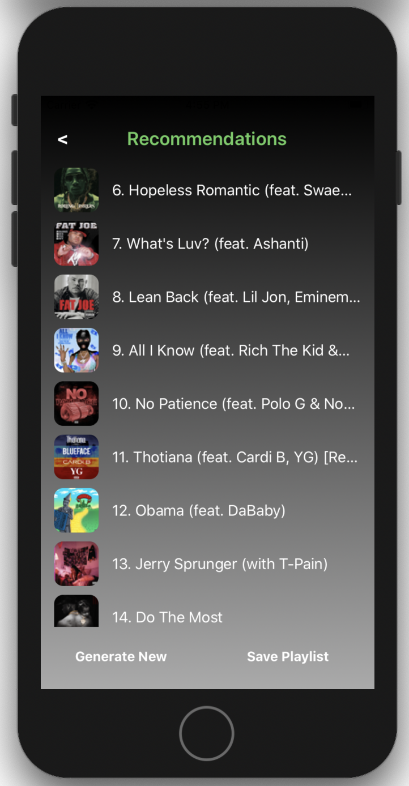

# SpotiFriend
### Your personal Spotify assistant.

SpotiFriend is an iOS application designed to assist a Spotify user with their day-to-day use and management of their account. It's features include:
* Accessing recent and all-time personal top tracks.
* Accessing recent and all-time personal top artists.
* Analysing user playlists, providing statistics for the track metadata and figures indicating artist breakdowns.
* Creating savable recommended playlists for the user based on their recent listening history.
* Providing the functionality to save and access personal reviews for albums.
* Facilitating playlist management and sorting features.
* Providing direct links to artists, albums, playlists and songs from within the application.

**App Interface**

